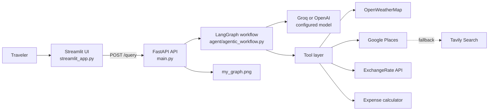

# AI Trip Planner

[](https://www.python.org/)
[](https://streamlit.io/)
[](https://fastapi.tiangolo.com/)
[](https://langchain-ai.github.io/langgraph/)
[](LICENSE)

An agentic travel-planning application that combines a Streamlit chat interface, a FastAPI service, LangGraph orchestration, and live travel data tools. Ask for an itinerary in natural language and the agent can enrich its answer with weather, places, transportation, budget calculations, and currency conversion.

> **Status:** Development project. External providers can return incomplete, delayed, or approximate data. Verify prices, opening hours, availability, safety guidance, visa rules, and travel requirements before making decisions.

## What It Does

- Generates destination-aware travel plans from natural-language requests.
- Retrieves current weather and multi-day forecasts.
- Searches attractions, restaurants, activities, and transportation options.
- Estimates hotel totals, trip totals, and daily budgets.
- Converts costs between currencies.
- Uses Google Places for place discovery and falls back to Tavily when a Google lookup fails.
- Exposes the same agent through a JSON API and a browser-based Streamlit UI.

## Architecture



### Request lifecycle

1. The Streamlit client sends the user's question to `POST /query`.
2. FastAPI creates a `GraphBuilder` using the configured model provider.
3. LangGraph lets the model decide whether a tool call is needed.
4. Tool results are returned to the model for final answer generation.
5. The API responds with an `answer` field containing the generated travel plan.

Each API request currently builds a fresh graph. Streamlit initializes session state, but the current frontend does not yet append or render a persistent multi-turn conversation history.

## Repository Layout

```text
.
├── agent/                  # LangGraph workflow and tool routing
├── config/                 # Model provider configuration
├── exception/              # Exception-related helpers
├── logger/                 # Logging helpers
├── prompt_library/         # System prompt used by the agent
├── tools/                  # LangChain tool definitions
├── utils/                  # Provider clients and shared calculations
├── main.py                 # FastAPI application and POST /query
├── streamlit_app.py        # Streamlit frontend
├── requirements.txt        # Runtime dependencies
├── pyproject.toml          # Project metadata and Python requirement
└── setup.py                # Editable-install configuration
```

## Requirements

- Python `3.14` or newer, as declared in `pyproject.toml`.
- API keys for the providers you plan to use.
- Network access from the machine running the backend.
- Windows PowerShell or Command Prompt instructions below can be adapted for macOS/Linux.

## Installation

### Option A: `venv` and `pip`

```powershell
py -3.14 -m venv env
.\env\Scripts\Activate.ps1
python -m pip install --upgrade pip
python -m pip install -r requirements.txt
```

If PowerShell blocks activation, run the project from an activated Command Prompt instead:

```bat
env\Scripts\activate.bat
python -m pip install -r requirements.txt
```

### Option B: `uv`

```powershell
uv venv env --python 3.14
.\env\Scripts\Activate.ps1
uv pip install -r requirements.txt
```

The editable install entry in `requirements.txt` installs this repository as a local package.

## Configuration

Create a `.env` file in the project root. Never commit this file or paste real credentials into documentation.

```dotenv
# Select at least one model provider.
GROQ_API_KEY=replace-with-your-groq-key
OPENAI_API_KEY=replace-with-your-openai-key

# Tool providers.
OPENWEATHERMAP_API_KEY=replace-with-your-openweathermap-key
GPLACES_API_KEY=replace-with-your-google-places-key
TAVILY_API_KEY=replace-with-your-tavily-key
EXCHANGE_RATE_API_KEY=replace-with-your-exchangerate-key
```

The model names are configured in [config/config.yaml](config/config.yaml):

```yaml
llm:
  openai:
    provider: "openai"
    model_name: "o4-mini"
  groq:
    provider: "groq"
    model_name: "llama-3.3-70b-versatile"
```

The current API entry point initializes the backend with the Groq provider. To use OpenAI instead, update the `GraphBuilder(model_provider=...)` call in `main.py` and ensure `OPENAI_API_KEY` is configured.

### Security note

If credentials have ever been committed, shared, or exposed, revoke and rotate them immediately. Add `.env` and generated artifacts such as `my_graph.png` to `.gitignore` before publishing the repository.

## Running Locally

Start the FastAPI backend first:

```powershell
.\env\Scripts\Activate.ps1
uvicorn main:app --reload --host 127.0.0.1 --port 8000
```

In a second terminal, start Streamlit:

```powershell
.\env\Scripts\Activate.ps1
streamlit run streamlit_app.py
```

Open the URL printed by Streamlit, normally `http://localhost:8501`, and try:

```text
Plan a 5-day trip to Goa for two people with a mid-range budget.
```

The FastAPI interactive documentation is available at `http://localhost:8000/docs` while the backend is running.

## API Reference

### `POST /query`

Request body:

```json
{
  "question": "Plan a three-day trip to Kyoto in October with a daily budget."
}
```

Example with PowerShell:

```powershell
$body = @{ question = "Plan a three-day trip to Kyoto in October" } | ConvertTo-Json
Invoke-RestMethod -Method Post -Uri http://127.0.0.1:8000/query -ContentType "application/json" -Body $body
```

Example response:

```json
{
  "answer": "# Kyoto Travel Plan\n..."
}
```

Failure response:

```json
{
  "error": "Provider or tool error details"
}
```

The API returns HTTP `500` when agent or tool execution fails. The backend also writes the compiled graph visualization to `my_graph.png` after a successful graph build.

## Agent Tools

| Tool group | Available operations | Provider or implementation |
| --- | --- | --- |
| Weather | Current conditions and forecasts | OpenWeatherMap |
| Places | Attractions, restaurants, activities, transportation | Google Places, with Tavily fallback |
| Expenses | Hotel totals, aggregate costs, daily budgets | Local calculator |
| Currency | Conversion between currencies | ExchangeRate API |

Tool selection is model-driven. A request may use several tools, one tool, or no external tool depending on the question.

## Troubleshooting

### Streamlit cannot reach the API

Confirm that Uvicorn is running on port `8000` and that `http://127.0.0.1:8000/docs` loads. The frontend currently uses `http://localhost:8000` as its backend URL.

### Provider authentication fails

Check that the expected variable is present in `.env`, the virtual environment is active, and the configured model is available for the selected provider. Restart the backend after changing environment variables.

### Place, weather, or currency data is missing

Check the relevant API key, provider quota, network access, and provider service status. Google Places failures are intended to fall back to Tavily, but the fallback still requires a valid Tavily configuration.

### The app returns a server error

Inspect the Uvicorn terminal for the provider or tool exception. Also check that the working directory is the repository root, because the application loads `config/config.yaml` using a relative path.

## Development Notes

- The backend is stateless per request; persistent sessions and authentication are not implemented.
- CORS currently allows all origins for local development. Restrict `allow_origins` before deployment.
- The frontend and backend use hardcoded local URLs and should be made environment-configurable for deployment.
- Generated graph images are written into the repository root and should normally be ignored by version control.
- External results are not guaranteed to be real-time, complete, or accurate.
- No automated test suite is currently defined in the repository. Validate changes by running both services and exercising representative travel, weather, place-search, expense, and currency requests.

## Production Checklist

- [ ] Rotate any credentials that were exposed during development.
- [ ] Store secrets in a managed secret store or deployment environment.
- [ ] Add `.env`, `my_graph.png`, caches, and virtual-environment folders to `.gitignore`.
- [ ] Restrict CORS to the deployed frontend origin.
- [ ] Configure the backend URL through an environment variable.
- [ ] Add request validation, authentication, rate limiting, and structured logging.
- [ ] Add automated tests for API errors, provider failures, fallback behavior, and calculations.
- [ ] Pin dependency versions and use a lockfile for reproducible deployments.
- [ ] Review generated travel information before presenting it as authoritative.

## Contributing

1. Create a focused feature branch.
2. Keep credentials and generated artifacts out of commits.
3. Preserve the provider abstraction when adding new data sources.
4. Run both services locally and test a representative travel query.
5. Update this README when setup, configuration, or API behavior changes.

## License

This project is licensed under the [MIT License](LICENSE).
