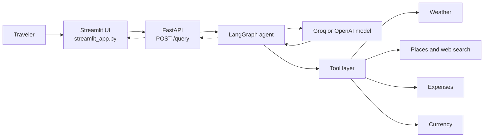

# AI Trip Planner

An agentic travel-planning application that turns a natural-language request into a practical, research-backed itinerary. The application combines a Streamlit chat interface, a FastAPI service, LangGraph orchestration, live search tools, weather data, currency conversion, and expense calculations.

> **Status:** Active development. Generated plans are recommendations, not reservations or professional travel advice. Verify prices, opening hours, weather, visa requirements, and local safety guidance before booking or travelling.

## Highlights

- Natural-language trip planning through a simple Streamlit interface
- Day-by-day itineraries with tourist and off-beat alternatives
- Attraction, restaurant, activity, and transportation discovery
- Current weather and forecast lookups
- Hotel, daily-budget, total-expense, and currency calculations
- LangGraph ReAct-style tool loop for multi-step research
- Provider configuration for Groq and OpenAI models
- FastAPI endpoint suitable for a separate frontend or API client

## How It Works



The backend creates a graph for each request. The model can call one or more tools, receive their results, and continue reasoning before returning a Markdown travel plan.

## Project Layout

| Path | Responsibility |
| --- | --- |
| `streamlit_app.py` | User-facing Streamlit chat application |
| `main.py` | FastAPI application and `POST /query` endpoint |
| `agent/agentic_workflow.py` | LangGraph state graph and tool orchestration |
| `tools/` | LangChain tool definitions exposed to the model |
| `utils/` | Provider clients, calculations, configuration, and search helpers |
| `prompt_library/prompt.py` | System instructions for travel-plan generation |
| `config/config.yaml` | LLM provider and model names |
| `requirements.txt` | Runtime dependencies |

## Requirements

- Python 3.14 or newer, as declared in `pyproject.toml`
- API credentials for the providers you intend to use
- Internet access for live weather, place, search, and exchange-rate requests

## Installation

### Windows PowerShell

```powershell
git clone <repository-url>
cd AI_TRIP_PLANNER

python -m venv env
.\env\Scripts\Activate.ps1
python -m pip install --upgrade pip
pip install -r requirements.txt
```

If PowerShell blocks activation, use the environment directly or activate it from Command Prompt:

```bat
env\Scripts\activate.bat
```

The project also contains `pyproject.toml` and supports editable installation:

```powershell
pip install -e .
```

## Configuration

Create a `.env` file in the project root. Keep it local and never commit it.

```dotenv
# Required by the default backend provider
GROQ_API_KEY=your_groq_api_key

# Required only when using the OpenAI provider
OPENAI_API_KEY=your_openai_api_key

# Tool credentials
OPENWEATHERMAP_API_KEY=your_openweathermap_api_key
GPLACES_API_KEY=your_google_places_api_key
TAVILY_API_KEY=your_tavily_api_key
EXCHANGE_RATE_API_KEY=your_exchange_rate_api_key
```

The default backend uses Groq and reads its model from `config/config.yaml`:

```yaml
llm:
	groq:
		provider: groq
		model_name: llama-3.3-70b-versatile
```

To use OpenAI in backend code, instantiate `GraphBuilder(model_provider="openai")` and provide `OPENAI_API_KEY`. The current API route selects Groq by default.

## Run Locally

The Streamlit frontend expects the API at `http://localhost:8000`, so start the services in separate terminals.

**Terminal 1: API**

```powershell
uvicorn main:app --reload --port 8000
```

**Terminal 2: Streamlit**

```powershell
streamlit run streamlit_app.py
```

Open the URL printed by Streamlit, usually `http://localhost:8501`, then try:

```text
Plan a 5-day trip to Goa for two people with a mid-range budget.
```

## API Usage

### `POST /query`

Request:

```bash
curl -X POST http://localhost:8000/query \
	-H "Content-Type: application/json" \
	-d "{\"question\":\"Plan a three-day trip to Kyoto in October\"}"
```

Successful response:

```json
{
	"answer": "# Kyoto Travel Plan\n..."
}
```

The endpoint returns HTTP `500` with an `error` field when agent or tool execution fails. FastAPI also exposes interactive documentation at `http://localhost:8000/docs` while the backend is running.

## Available Agent Tools

| Category | Capabilities |
| --- | --- |
| Weather | Current conditions and forecasts |
| Places | Attractions, restaurants, activities, and transportation |
| Expenses | Hotel totals, daily budgets, and aggregate trip costs |
| Currency | Conversion between currencies using the configured exchange-rate service |

Place discovery attempts Google Places first and falls back to Tavily when the Google lookup fails.

## Development Notes

- Backend requests are currently stateless; each request builds and invokes a fresh graph.
- The frontend hardcodes the backend URL as `http://localhost:8000`. Update `BASE_URL` in `streamlit_app.py` when deploying the API elsewhere.
- CORS is currently open to all origins for local development. Restrict `allow_origins` before production deployment.
- The API writes a generated graph image to `my_graph.png` for each successful request.
- API keys are loaded through `python-dotenv`; do not place secrets in `config/config.yaml`.
- Live results can be incomplete or stale. The model output should be reviewed before making financial or travel commitments.

## Troubleshooting

**The Streamlit page cannot reach the backend**

Confirm that Uvicorn is running on port `8000` and that `http://localhost:8000/docs` opens in a browser.

**The agent returns a provider or authentication error**

Check that the relevant key is present in `.env`, the virtual environment is active, and the selected model in `config/config.yaml` is available to that provider.

**Place or weather data is missing**

Check the corresponding API key and provider quota. Search and weather tools depend on external services and network connectivity.

## Contributing

1. Create a feature branch.
2. Keep provider keys and generated files out of commits.
3. Make focused changes and update this README when setup or behavior changes.
4. Run both services locally and verify a representative travel query before opening a pull request.

## License

This project is licensed under the [MIT License](LICENSE).
